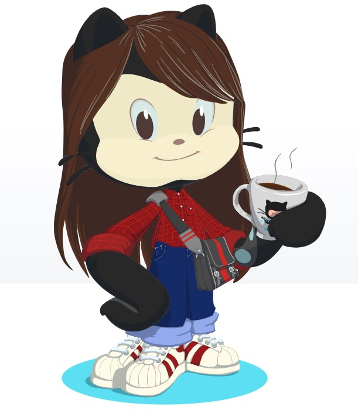

## {"Hello"} I'm Rhay

  

  <a href="https://github.com/rhaycf">
  
  

  
##
  

  

  
##
  

  

                                                                           
  

### 🧠"É possível fazer o que você quiser e, se encontrar uma barreira, passe por cima dela, contorne-a, passe por baixo ou encontre outro caminho para o seu objetivo!!"

 
  

  - 🌱 Atualmente estou aprendendo: Javascript 
  - 📠Atualmente estou morando: ES - Brasil 
  - 😄 Pronomes: ela/dela 
  - 📫 Como entrar em contato comigo: 

  
  
  

  
  
   

